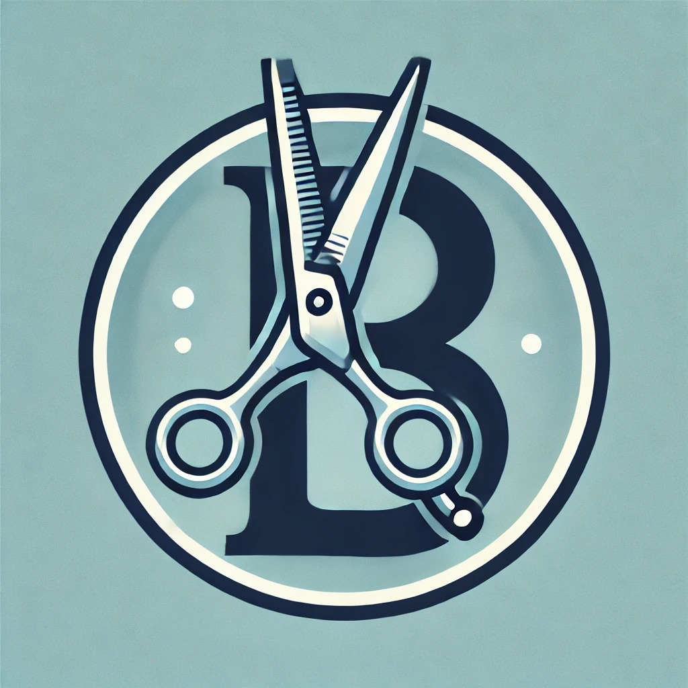

# Barber-Service

  

O Barber Service é um MVP Single feature Web (Mínimo Produto Viável Recurso Único) para a empresa ND Barbearia, para potencialmente facilitar o processo de
gerenciamento em relação as agendas dos stakeholders. A aplicação poderá permitir os clientes da barbearia escolher o barbeiro, o serviço desejado, e o horário disponível de forma prática e intuitiva. A aplicação conta com:

- Interface gráfica amigável e bonita;
- Aplicação com perfis múltiplos: ADMINISTRADOR, Cliente e Barbeiro;

:rocket: Projeto com Arquitetura MVC e aplicações em Java.

## Tecnologias Utilizadas

 
  
  
  
  
  

## Diagrama de Caso de Uso

  

## Histórico de commits
- Veja [Histórico de Commits](https://github.com/pedroynk/barber-service/commits/master) dos Colaboradores
